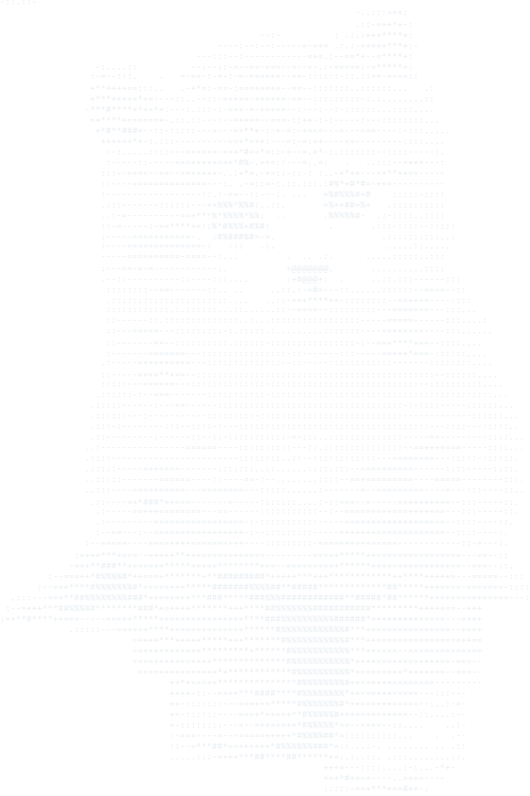

<div align="center">
<table>
<tr>

<td width="220" align="center" valign="middle">

</td>

<td valign="middle">

```bash
aniruddh@github
-------------------
OS:                Aniruddh Uniyal
  Uptime:          Booted Jul 1, 2024
    Host:          Chennai, India
      Languages:   Python, C++, Ada, ASM
        UI:        PyQt5 / PyQt6 / Qt
      Focus:       AI/ML, Cybersecurity, Robotics, BCI
    Network:       CCNA / CCNP / CCIE track
  Shell:           zshrc
Status:            open to freelance work
```

<code>aniruddh@github:~$</code> whoami<br>
Aniruddh Uniyal
<br>

<code>aniruddh@github:~$</code> code<br>
initializing codebase▐
<br>


</td>

</tr>
</table>
</div>
